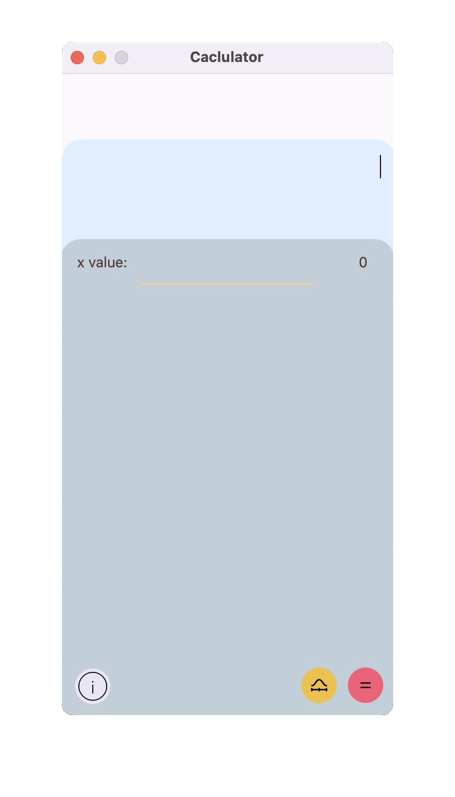

## Calculator
School 21 programming school educational project. 
The project is developed following the MVP pattern on the Qt framework, in C++17 language . 

  

The calculator accepts parenthetical expressions, converts them to reverse Polish notation
using Dijkstra's "shunting yard" algorithm and calculates the result of the entered expression.

When you click equal, the calculations are recorded in history. Where the first line is is your expression. The second expression is in reverse Polish notation. The third line contains the result.

To view the list of supported expressions, click on the `i` key in the lower left corner.

The application can also build a graph of a function, to do this, click on the yellow button and enter an expression containing `x`.
 
 
## Installation
To install, you will need Qt version 6, qmake version 6, make, and a GCC compiler. 
Navigate to the `src` directory and run the `make install` command.
